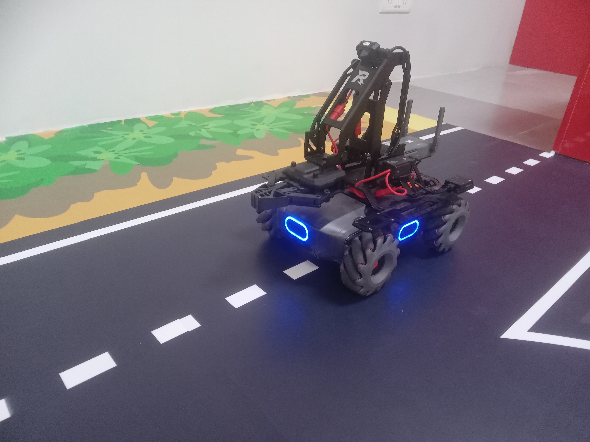

# MobileRobot-Openloopcontrol
## Aim:

To develop a python control code to move the mobilerobot along the predefined path.

## Equipments Required:
1. RoboMaster EP core
2. Python 3.7

## Procedure

Step1:

Initiate the MobileRobot.

Step2:

Connect your PC with the MobileRobot.

Step3:

Open Python program.

Step4:

Program the movements of the robot using python code.

Step5:

Execute the python program.

## Program
```python
from robomaster import robot
import time


if __name__ == '_main_':
    ep_robot = robot.Robot()
    ep_robot.initialize(conn_type="ap")

    ep_chassis = ep_robot.chassis
    ep_led = ep_robot.led
    
    ep_led.set_led(comp="all",r=255,g=0,b=0,effect="on")   
    time.sleep(2)
        
    ep_chassis.move(x=2.2, y=0, z=0, xy_speed=0.75).wait_for_completed()
    ep_chassis.move(x=0, y=0, z=42, xy_speed=1).wait_for_completed()
    ep_chassis.move(x=3, y=0, z=0, xy_speed=0.75).wait_for_completed()
    ep_led.set_led(comp="all",r=0,g=255,b=0,effect="on")
    ep_chassis.drive_speed(x=.25,y=0,z=-15)
    time.sleep(17)

    ep_chassis.drive_speed(x=0,y=0,z=0)
    ep_chassis.move(x=1.5, y=0, z=0, xy_speed=0.75).wait_for_completed()
    ep_led.set_led(comp="all",r=0,g=0,b=255,effect="on")
    ep_robot.close()


    
    ep_robot.close()
```

## MobileRobot Movement Image:




## MobileRobot Movement Video:

(https://drive.google.com/file/d/16UBO_rqnuQDVSYgIg2lmVb0Evl5PBUa2/view?usp=drivesdk)
## Result:
Thus the python program code is developed to move the mobilerobot in the predefined path.


<br/>
<br/>

```
Mobile Robotics Laboratory
Department of Artificial Intelligence and Data Science/ Machine Learning
Saveetha Engineering College
```
